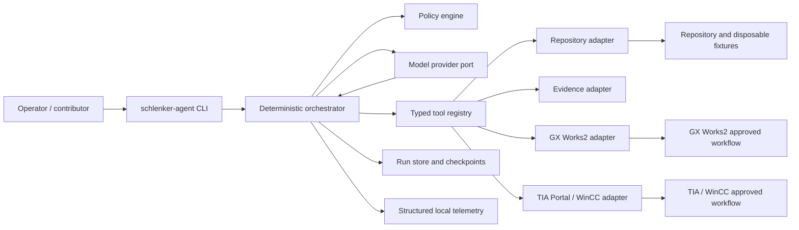
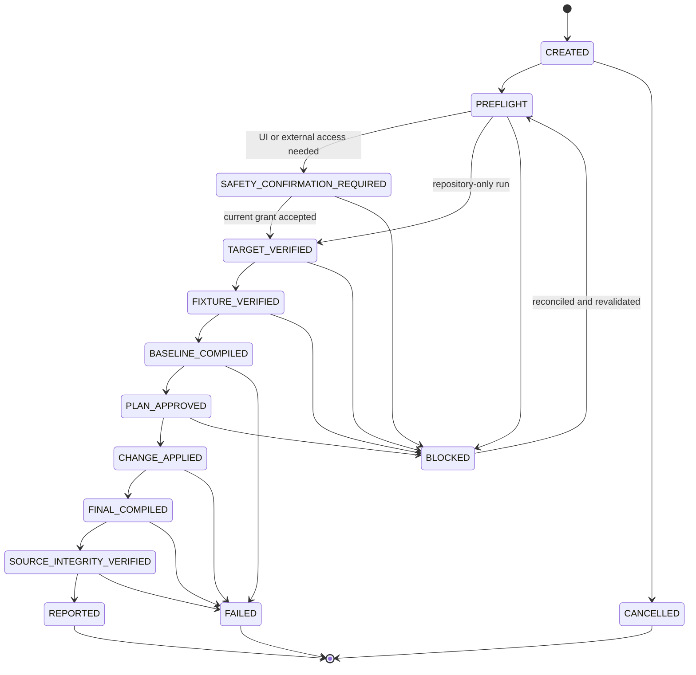
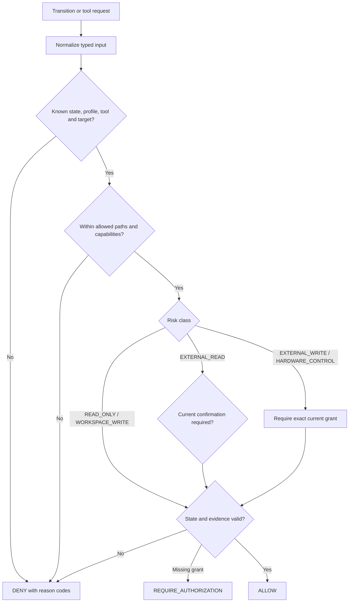
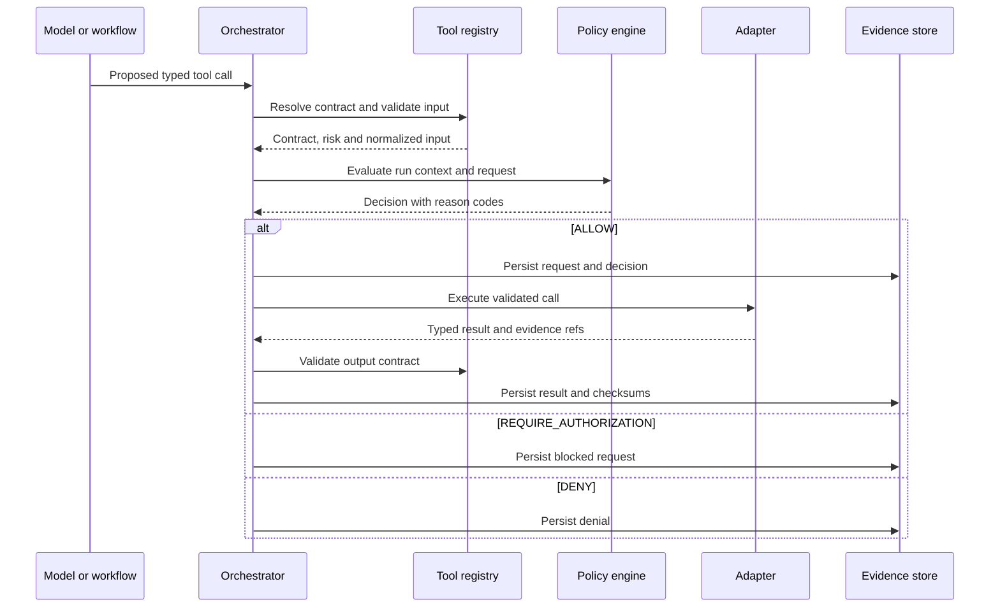

# Schlenker Agent Foundation — Design

## Overview

The current repository has strong written safety rules, task/report templates,
platform profiles, disposable-project conventions, and evidence practices. The
next step is not to replace those controls with an agent framework. It is to
encode them in a small executable runtime whose deterministic components control
state, authorization, tool access, and audit evidence.

The proposed architecture is a modular monolith with one orchestrator, one
policy engine, typed ports, and platform-specific adapters. A language model can
plan and propose calls, but it cannot directly change state, grant permission,
or invoke an adapter. This keeps the initial runtime understandable and makes it
possible to add GX Works2 and TIA Portal capabilities independently.

## Design goals

- Make safety constraints executable and testable.
- Prove one complete offline workflow before adding GUI or hardware access.
- Keep model-provider, platform, storage, and telemetry dependencies replaceable.
- Resume interrupted work without silently repeating side effects.
- Produce audit evidence from runtime facts, not from the model's narrative.
- Let contributors implement and review one vertical concern at a time.

## Non-goals

- A general-purpose autonomous agent framework.
- Multi-agent delegation or distributed scheduling.
- A vector database, free-form long-term memory, web server, or dashboard.
- Hardware-control executors in the first release.
- Encoding safety policy only in prompt text.
- Making GX Works2 and TIA Portal share GUI implementation details.

## Architecture principles

1. **Deterministic shell, probabilistic core.** The model proposes; typed code
   validates, authorizes, executes, and records.
2. **Fail closed.** Unknown tools, paths, states, targets, profiles, or grants
   result in denial.
3. **One source of truth.** Python typed models are canonical; JSON Schemas are
   generated and checked for drift.
4. **Narrow boundaries.** The orchestrator depends on ports, not vendor SDKs,
   GUI wrappers, or filesystem details.
5. **Evidence before claims.** A successful report requires verified evidence
   and integrity checks.
6. **Capability progression.** Repository-only, then offline platform tooling,
   then reviewed GUI reads; hardware writes remain a separate future decision.
7. **Progressive context.** Load only the policy, prompt, tool contract, and
   project context required for the current state.

## System context



The policy engine is consulted before every transition and tool execution. An
adapter receives a validated request only after a decision permits it.

## Target repository layout

```text
Schlenker/
├── AGENTS.md
├── pyproject.toml
├── src/
│   └── schlenker_agent/
│       ├── __init__.py
│       ├── cli.py
│       ├── domain/
│       │   ├── authorization.py
│       │   ├── evidence.py
│       │   ├── policy.py
│       │   ├── run.py
│       │   ├── task.py
│       │   └── tools.py
│       ├── orchestrator/
│       │   ├── engine.py
│       │   ├── transitions.py
│       │   └── workflow.py
│       ├── policy/
│       │   ├── engine.py
│       │   ├── rules.py
│       │   └── normalization.py
│       ├── tools/
│       │   ├── contracts.py
│       │   ├── executor.py
│       │   └── registry.py
│       ├── ports/
│       │   ├── model.py
│       │   ├── platform.py
│       │   ├── run_store.py
│       │   └── telemetry.py
│       ├── adapters/
│       │   ├── evidence/
│       │   ├── gxworks2/
│       │   ├── model/
│       │   ├── repository/
│       │   ├── storage/
│       │   └── tia_v19/
│       ├── prompts/
│       ├── reporting/
│       └── telemetry/
├── agent/
│   ├── contracts/
│   ├── prompts/
│   └── templates/
├── schemas/
│   └── generated/
├── profiles/
├── tests/
│   ├── unit/
│   ├── integration/
│   ├── contract/
│   ├── property/
│   └── evals/
├── specs/
├── docs/
│   └── adr/
└── runs/
```

`src/schlenker_agent/prompts/` contains runtime prompt-loading code.
`agent/prompts/` contains versioned prompt assets. This distinction prevents
templates from becoming importable runtime modules. The existing documents are
moved only after references have been inventoried and compatibility links or
documentation have been prepared.

## Policy hierarchy

Repository instruction files should follow ownership and risk boundaries:

```text
AGENTS.md                                  shared safety and audit rules
fixtures/projects/AGENTS.md                protected source / fixture rules
fixtures/projects/schlenker-working/
  AGENTS.md                                GX Works2 disposable project rules
REV12/AGENTS.md                            TIA / WinCC project artifact rules
tools/tia-v19-openness/AGENTS.md           TIA Openness tool rules
src/schlenker_agent/AGENTS.md              runtime engineering invariants
```

The root file remains concise and platform-neutral. A nested file may add
constraints but cannot weaken a root safety boundary. CI validates that every
declared protected source and fixture belongs to exactly one applicable profile.

## Technology choices

### Runtime

- Python 3.13.
- `pyproject.toml` with a `src/` package layout.
- Pydantic v2 models as the canonical serialization and validation layer.
- PyYAML only at the profile/task input boundary.
- Standard-library `argparse` for the initial CLI.
- Standard JSON and JSON Lines for state, audit, and telemetry.
- Atomic file replacement for checkpoints; no database in the first release.

### Development

- pytest for unit, contract, integration, and eval runners.
- Hypothesis for state, path, authorization, schema, and redaction properties.
- Ruff for formatting and linting.
- mypy or Pyright as a type-checking gate, selected during Task 1.2 and recorded
  in an ADR to avoid two overlapping configurations.
- Gitleaks for repository secret scanning.

Versions are pinned or constrained only when implementation begins so that the
dependency selection is tested against the actual Windows environment. The
architecture does not depend on LangGraph, Temporal, a vector store, or a web
framework.

## Domain model

### TaskRequest

```text
schema_version
task_id
title
objective
platform_profile
requested_capabilities[]
allowed_paths[]
protected_sources[]
constraints[]
expected_outputs[]
acceptance_checks[]
```

The task is immutable once the run begins. A normalized snapshot is copied into
the run directory.

### RunRecord

```text
schema_version
run_id
task_id
status
current_state
sequence
created_at
updated_at
policy_version
profile_digest
task_digest
latest_checkpoint_digest
failure?
```

State mutation occurs only through `Orchestrator.transition()`. Each transition
appends a record and atomically replaces the current checkpoint.

### AuthorizationGrant

```text
grant_id
run_id
target_identity
operation
risk_class
issued_by
issued_at
expires_at
single_use
consumed_at?
evidence_ref
```

Matching is exact by default. Wildcards are prohibited for
`EXTERNAL_WRITE` and `HARDWARE_CONTROL`.

### ToolContract

```text
name
version
description
input_model
output_model
risk_class
side_effects[]
required_states[]
required_evidence[]
timeout_seconds
retry_policy
idempotency_mode
adapter
```

The registry stores contracts and bound executors separately, allowing a future
hardware tool to be documented while remaining unbound and therefore
unexecutable.

### PolicyDecision

```text
decision_id
outcome                  ALLOW | DENY | REQUIRE_AUTHORIZATION
reason_codes[]
normalized_input_digest
matched_rules[]
policy_version
authorization_refs[]
decided_at
```

### EvidenceRecord

```text
evidence_id
run_id
producer
evidence_type
content_ref
sha256
created_at
sensitivity
provenance
related_transition?
related_tool_call?
metadata
```

The record points to content; it does not embed arbitrary large or sensitive
payloads in the state file.

## Run state machine



For a repository-only vertical slice, `BASELINE_COMPILED` and `FINAL_COMPILED`
represent configured deterministic validation commands. A platform profile can
later specialize those steps as PLC/HMI compile operations without changing the
state semantics.

### Transition invariant

A transition is committed only if all of the following are true:

1. source state and destination are in the transition table;
2. task and profile schemas are supported;
3. required tool results and evidence are valid;
4. the policy outcome is `ALLOW`;
5. a required grant is exact, current, and unconsumed;
6. the new checkpoint can be persisted atomically.

The state event is appended before the current-state pointer is replaced. On
startup, the store verifies the event chain and checkpoint checksum.

## Policy evaluation



Rules are pure functions over normalized typed inputs. Reason codes are stable
constants such as `UNKNOWN_TOOL`, `PATH_OUTSIDE_WORKSPACE`,
`PROTECTED_SOURCE_WRITE`, `INVALID_STATE`, `STALE_AUTHORIZATION`,
`TARGET_MISMATCH`, and `MISSING_EVIDENCE`. No adapter is called during policy
evaluation.

## Tool execution pipeline



Tool output is untrusted until it passes output-model validation. The executor
does not automatically retry side-effecting calls. Read-only retries use bounded
backoff without sleeping longer than the configured operation timeout.

## Ports and adapters

### PlatformAdapter port

The common protocol exposes capability-oriented methods rather than GUI actions:

- `doctor(profile) -> EnvironmentCheckResult`
- `resolve_project(profile, task) -> ProjectIdentity`
- `verify_target(profile, observed) -> TargetVerification`
- `verify_fixture(project) -> IntegritySnapshot`
- `baseline_validate(project) -> ValidationResult`
- `apply_change(change_request) -> ChangeResult`
- `final_validate(project) -> ValidationResult`
- `collect_evidence(request) -> EvidenceResult`
- `capabilities() -> CapabilitySet`

An adapter may implement a method as `UNSUPPORTED_CAPABILITY`. It must not fall
back to generic desktop control.

### Repository adapter

The first adapter provides:

- safe path resolution and containment;
- file metadata and SHA-256 hashes;
- read-only repository status and revision discovery;
- allowlisted validation commands;
- atomic local writes only when a task explicitly permits them;
- before/after change inventory.

Shell command strings are never generated by the model. An allowlisted command
definition contains executable, argument template, working-directory rule,
timeout, and expected artifacts.

### Evidence adapter

The evidence adapter creates the run directory, writes content atomically,
computes checksums, enforces sensitivity rules, and maintains `evidence/index.json`.
It rejects paths outside the current run directory.

### GX Works2 adapter

Initial implementation stages:

1. profile and environment diagnostics;
2. fixture/protected-source validation;
3. offline compile contract using the approved Computer Use and hybrid-capture
   workflow only after current operator confirmation;
4. reviewed read-only diagnostics;
5. no hardware-control executor in the first release.

The existing Windows 10 capture helper remains evidence-only. It cannot become
an input or blind coordinate-control channel.

### TIA Portal / WinCC adapter

Initial implementation stages:

1. profile and TIA V19 environment diagnostics;
2. existing Openness helper inventory and typed wrapper;
3. offline project/export validation;
4. compile/evidence capability only after the applicable nested policy exists;
5. no hardware-control executor in the first release.

## Model provider and context flow

`ModelPort` accepts a normalized request containing:

- prompt ID and version;
- current run state and goal;
- applicable policy summary (informational, not authoritative);
- permitted tool contracts for the current state;
- bounded task/project context;
- prior model outputs needed for the current step.

The response contains text, zero or more structured tool proposals, usage,
provider/model identifiers, stop reason, and a typed provider error. Provider
SDK objects do not cross the adapter boundary.

The first test implementation is `FakeModelAdapter`, which replays deterministic
responses. One real provider adapter can be selected later without changing the
orchestrator. Prompt and model changes trigger the eval suite.

## Prompt and context organization

```text
agent/
├── prompts/
│   ├── system/
│   ├── planning/
│   ├── execution/
│   └── reporting/
├── contracts/
│   └── tool-guidance/
└── templates/
    ├── task/
    └── report/
```

Each prompt has front matter with ID, semantic version, intended state, required
inputs, allowed tools, and output schema. The context builder produces a
manifest of included files/digests and labels content as system instruction,
operator instruction, untrusted project data, tool output, or evidence.

Policy documents are not copied into prompts as the enforcement mechanism. A
short policy summary helps the model choose valid actions, while the real policy
engine independently evaluates every proposal.

## Persistence and evidence layout

```text
runs/<run-id>/
├── manifest.json
├── task.json
├── profile.json
├── checkpoint.json
├── events.jsonl
├── policy-decisions.jsonl
├── tool-calls.jsonl
├── model-calls.jsonl
├── telemetry.jsonl
├── authorizations/
├── evidence/
│   ├── index.json
│   ├── integrity/
│   ├── build/
│   ├── screenshots/
│   └── artifacts/
├── report.json
└── report.md
```

`manifest.json` contains schema versions and file checksums. Large evidence is
stored by reference. Sensitive content is redacted or represented only by a
checksum and minimal metadata. Run directories are local artifacts and are
ignored by default unless a sanitized fixture is intentionally curated for an
eval.

## CLI design

```text
schlenker-agent doctor --profile <name>
schlenker-agent validate --profile <path> [--task <path>] [--all]
schlenker-agent run --profile <path> --task <path>
schlenker-agent status --run-id <id> [--json]
schlenker-agent resume --run-id <id>
```

The CLI is a thin composition root. It loads configuration, creates ports and
adapters, calls application services, renders results, and maps typed failures
to stable exit codes. It contains no policy rules.

Suggested exit-code groups:

| Code | Meaning |
|---:|---|
| 0 | Success |
| 2 | CLI usage or schema validation failure |
| 10 | Policy denial |
| 11 | Authorization required or blocked |
| 20 | Tool or adapter failure |
| 21 | Timeout or uncertain side effect |
| 30 | Evidence or source-integrity failure |
| 70 | Unexpected internal failure |

## Error handling, retry, and resume

- Domain errors are typed and serializable; adapters translate vendor errors at
  their boundary.
- Validation and policy failures have no tool side effects.
- Only contracts marked retryable may retry automatically.
- `EXTERNAL_WRITE` and `HARDWARE_CONTROL` never retry automatically.
- An uncertain side effect produces `BLOCKED`, not `FAILED`, because external
  reconciliation is required.
- Resume verifies the event chain, checkpoint digest, schema compatibility,
  profile/task digests, current policy, target state, and authorization expiry.
- A policy update may require replaying the last decision before resumption.

## Security and trust boundaries

### Trusted control plane

- canonical typed models;
- state-transition table;
- policy engine and versioned rules;
- registered tool contracts and bound executors;
- current task/profile snapshots after validation.

### Untrusted inputs

- model output;
- project source and comments;
- tool stdout/stderr;
- screenshots and OCR;
- environment variables and external files;
- operator text until converted into a typed task or authorization grant.

Untrusted input never selects an executable, working directory, output path, or
policy rule directly. Secrets are read through a provider boundary and are never
included in prompt/context manifests.

## Observability

The runtime emits JSON Lines events through `TelemetryPort`. Every event has:

- event name and schema version;
- run, transition, tool-call, and model-call correlation IDs as applicable;
- start/end timestamps and duration;
- outcome and stable failure category;
- redacted attributes.

An optional OpenTelemetry adapter is deferred. The local interface is designed
so adding one does not change domain or orchestration modules.

## Reporting

The report renderer consumes canonical run records and evidence indexes. The
Markdown report includes:

- objective and scope;
- task/profile/policy/prompt/model versions;
- state path and material policy decisions;
- actions and outputs;
- compile/validation results;
- protected-source integrity result;
- evidence links and provenance;
- facts, inferences, operator assertions, skipped steps, and unresolved risks;
- final status.

The model may draft explanatory prose, but status, checks, hashes, decisions,
and evidence lists come from typed runtime data.

## Test strategy

### Unit tests

- model and schema validation;
- transition-table acceptance and rejection;
- policy rules and reason codes;
- authorization scope, expiry, and single-use behavior;
- path containment including Windows case and separator edge cases;
- redaction and sensitivity handling;
- tool input/output validation;
- report derivation.

### Property-based tests

Key invariants:

1. no generated path outside an allowed root is permitted;
2. no invalid transition changes current state;
3. terminal success cannot occur without all mandatory evidence;
4. broader or stale grants never authorize narrower current operations by
   accident;
5. serialize/deserialize round trips preserve canonical domain values;
6. secret-classified values never appear in persisted telemetry;
7. retry logic never retries a side-effecting risk class automatically.

### Contract tests

Every adapter is tested against the shared `PlatformAdapter` and tool contract.
Unsupported capabilities must return the correct typed result. No contract test
requires a real PLC.

### Integration tests

- CLI diagnostics and validation;
- full repository-only vertical slice;
- interruption and resume from checkpoints;
- corrupted checkpoint/evidence rejection;
- report JSON/Markdown consistency;
- fake-model malformed and prohibited tool proposals.

### Evals

Each eval fixture includes a task, profile, fake-model trace or bounded provider
configuration, expected state path, permitted/prohibited calls, required
evidence, and deterministic graders. An advisory model grader may assess report
clarity but cannot override deterministic failures.

## CI pipeline

Initial pull-request gates:

1. repository policy/profile/spec validation;
2. Ruff format and lint;
3. selected static type checker;
4. unit, property, contract, and repository-only integration tests;
5. generated JSON Schema drift check;
6. Gitleaks secret scan;
7. `.gitattributes` and ignored-sensitive-file checks;
8. requirement-to-task reference validation;
9. mandatory append-only change-log hook.

GUI/platform integration tests are opt-in and run only on an approved Windows
engineering host after the applicable current-run safety confirmation. They are
not part of a generic cloud CI runner.

## First vertical slice

The proving workflow is intentionally repository-only:

1. `run` loads a task and profile.
2. Preflight validates schemas, paths, repository revision, and writable run
   storage.
3. Repository adapter records protected-source metadata/hashes.
4. Policy permits an allowlisted read-only inspection and configured offline
   validation command.
5. Fake model proposes a bounded plan or the workflow uses a deterministic plan.
6. The run advances through the state machine, capturing evidence at every gate.
7. Repository adapter rechecks protected-source integrity.
8. Report renderer produces JSON and Markdown.

The slice is successful only when the same production paths for state, policy,
registry, adapters, evidence, and reporting are used. No GX Works2 or TIA Portal
application is launched.

## Rollout plan

### Phase 0 — Governance and clean baseline

Confirm merged baseline, preserve the current dirty worktree, split shared and
platform-specific policy, and record foundational ADRs.

### Phase 1 — Executable foundation

Create package, schemas, run store, state machine, policy engine, tool registry,
repository/evidence adapters, CLI, and deterministic tests.

### Phase 2 — Offline vertical slice

Complete a repository-only task end to end and establish eval/CI gates.

### Phase 3 — Offline platform adapters

Add GX Works2 and TIA V19 diagnostic, fixture, export, and compile capabilities
independently behind their profiles and nested policies.

### Phase 4 — Reviewed GUI reads

Only after offline evidence is reliable, add explicitly approved read-only GUI
workflows with current operator confirmation and platform-specific evidence.

### Phase 5 — Future hardware decision

Hardware write/control remains disabled. Enabling any executor requires a new
spec, threat/safety review, explicit authorization model review, test-fixture
environment, and operator acceptance.

## Architecture decisions to record

| ADR | Decision |
|---|---|
| ADR-001 | Modular monolith and deterministic orchestrator |
| ADR-002 | Pydantic models canonical; JSON Schema generated |
| ADR-003 | File-backed atomic checkpoints for the first release |
| ADR-004 | Fail-closed pure policy engine outside the model |
| ADR-005 | Platform capability adapters, no generic GUI fallback |
| ADR-006 | Local JSONL telemetry with optional future OTel port |
| ADR-007 | Hardware executors disabled in the first release |
| ADR-008 | Prompt assets separated from runtime code |

## Requirements traceability

| Requirement | Design sections |
|---|---|
| 1 | Target repository layout; Technology choices |
| 2 | Policy hierarchy; CI pipeline |
| 3 | Technology choices; Domain model |
| 4 | Run state machine; Persistence and evidence layout |
| 5 | Domain model; Policy evaluation |
| 6 | Domain model; Tool execution pipeline |
| 7 | Policy evaluation; Security and trust boundaries |
| 8 | Repository adapter; First vertical slice |
| 9 | Ports and adapters |
| 10 | CLI design |
| 11 | Model provider and context flow; Prompt organization |
| 12 | Persistence and evidence layout; Reporting |
| 13 | Observability; Security and trust boundaries |
| 14 | Error handling, retry, and resume |
| 15 | Test strategy |
| 16 | CI pipeline; Target repository layout |
| 17 | Model provider and context flow |
| 18 | Policy hierarchy; Architecture decisions; Reporting |
| 19 | First vertical slice; Rollout plan |

## Open decisions before implementation

These are bounded implementation choices, not missing product requirements:

1. Select mypy or Pyright after a minimal Windows proof and record ADR-009.
2. Confirm the canonical TIA V19 protected source, disposable workspace, and
   supported offline compile/export mechanism before Phase 3.
3. Decide whether sanitized run fixtures belong under `tests/evals/fixtures/` or
   a dedicated `evals/` root after the first vertical slice.
4. Establish local retention periods for non-sanitized run evidence before GUI
   integration begins.
